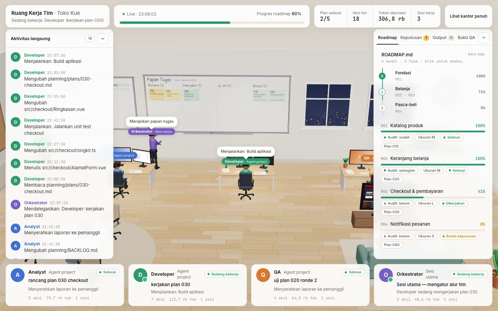
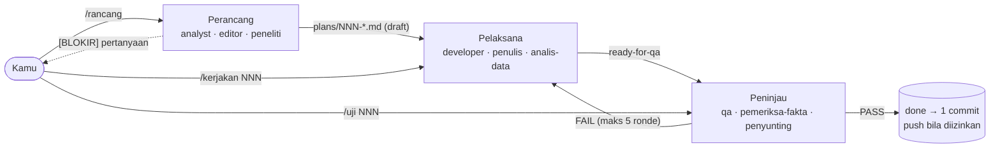
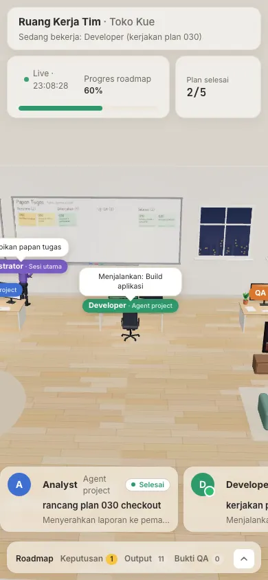
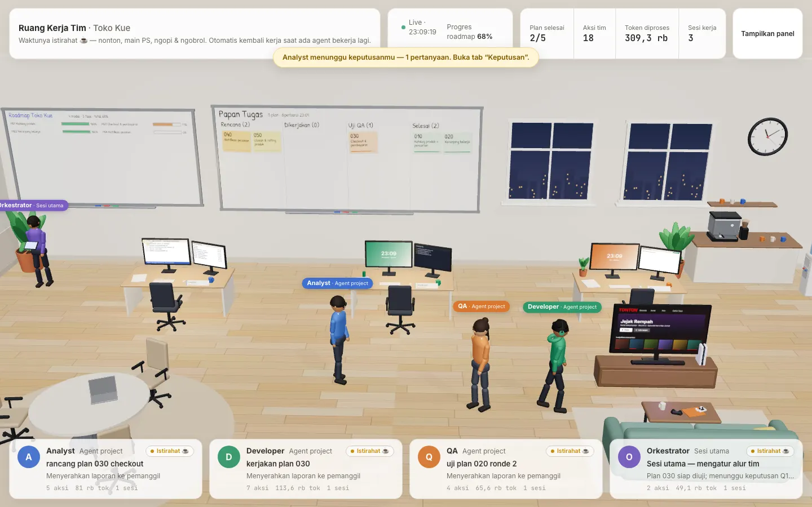

# Tim AI + Kantor 3D untuk Claude Code

> **English summary.** `claude-tim-ai-3D` is a [Claude Code](https://code.claude.com) plugin marketplace with the
> **tim-ai** plugin: one skill that reads your project, proposes a multi-agent team (presets *software*, *konten*
> (content), *riset* (research), *ops*, or custom roles) for you to confirm, then installs the agents
> (`.claude/agents/`), a written **plan → execute → review → commit** workflow with the project commands
> `/rancang` `/kerjakan` `/uji` `/jalankan` `/papan`, a `planning/` folder, and a live 3D office to watch the team
> work. The 3D office is the separate [kantor-3d](https://github.com/humaedihume/kantor-3d) plugin, declared as a plugin
> dependency and installed automatically — no duplicated code. Install with
> `/plugin marketplace add humaedihume/claude-tim-ai-3D` → `/plugin install tim-ai@claude-tim-ai-3D`, then run
> `/tim-ai:tim-ai` in your project. UI and docs are in Bahasa Indonesia. MIT licensed.



**Tim AI** membentuk tim subagent Claude Code untuk project-mu — misalnya Analyst → Developer → QA — lengkap dengan
alur kerja tertulis: setiap pekerjaan dirancang menjadi *plan*, dikerjakan, direview dengan standar **nol bug**, lalu
disimpan (satu commit per plan). Semua jejaknya ada di folder `planning/`, dan kamu bisa memantau timnya dari
browser/HP lewat **Kantor 3D**.

Repo ini berisi marketplace `claude-tim-ai-3D` dengan dua entri:

| Plugin | Isi | Sumber |
|---|---|---|
| `tim-ai` | skill `tim-ai` (+ template agent, perintah, planning) | folder [`plugins/tim-ai`](plugins/tim-ai) di repo ini |
| `kantor-3d` | skill `kantor-3d` (dashboard 3D `/kerja`) | repo [humaedihume/kantor-3d](https://github.com/humaedihume/kantor-3d) — **dependensi** `tim-ai` |

## Daftar isi
- [Kebutuhan](#kebutuhan) · [Mulai cepat](#mulai-cepat-plugin) · [Pasang manual](#pasang-manual)
- [Preset tim](#preset-tim) · [Perintah tim](#perintah-tim) · [Alur kerja](#alur-kerja) · [Folder planning/](#folder-planning)
- [Contoh pemakaian](#contoh-pemakaian-langkah-demi-langkah) · [Cara kerja](#cara-kerja) · [Konfigurasi](#konfigurasi)
- [Kantor 3D: mode menjalankan](#kantor-3d-mode-menjalankan) · [Cron / headless](#cron--headless-claude--p)
- [Memperbarui](#memperbarui) · [Mencopot](#mencopot) · [Masalah umum / FAQ](#masalah-umum--faq) · [Privasi](#privasi)
- [Batasan](#batasan) · [Kontribusi](#kontribusi) · [Lisensi](#lisensi)

## Kebutuhan
| Komponen | Keterangan |
|---|---|
| **Claude Code** | Versi dengan dukungan plugin, marketplace, **dependensi plugin**, dan subagent (`.claude/agents`). Diuji di v2.1.283. |
| **Node ≥ 18** | Untuk `bin/periksa.mjs` (verifikasi) dan salah satu runtime kantor 3D. |
| **PHP ≥ 8.1** (+ `mbstring`) | Opsional — runtime alternatif kantor 3D (cukup salah satu: PHP atau Node). |
| git | Disarankan — "simpan" = satu commit per plan yang lolos review (tanpa git: langkah commit dilewati). |
| Playwright | Opsional (preset software) — `tools/qa/shot.mjs` untuk bukti screenshot QA. |
| Valet / Nginx / cloudflared | Opsional — cara menyajikan kantor 3D (lihat [README kantor-3d](https://github.com/humaedihume/kantor-3d#mode-menjalankan)). |

## Mulai cepat (plugin)
```text
/plugin marketplace add humaedihume/claude-tim-ai-3D
/plugin install tim-ai@claude-tim-ai-3D
/reload-plugins
```
Atau dari terminal: `claude plugin marketplace add humaedihume/claude-tim-ai-3D && claude plugin install tim-ai@claude-tim-ai-3D`.

`tim-ai` mendeklarasikan `"dependencies": ["kantor-3d"]`, jadi Claude Code ikut memasang `kantor-3d` dari marketplace
yang sama (yang mengambilnya dari repo `humaedihume/kantor-3d`). Cek dengan `claude plugin list` — keduanya harus ada.

Lalu buka Claude Code **di root project-mu** dan jalankan:
```text
/tim-ai:tim-ai
```
(Skill plugin bernama `/<plugin>:<skill>`; kamu juga bisa cukup bilang "bentuk tim AI untuk project ini".)
Argumen opsional: `software | konten | riset | ops`, `--tanpa-kantor`, `--push`.

Skill akan membaca project, **mengusulkan** tim beserta model tiap peran, menanyakan konfirmasi (juga soal commit/push
dan cara menyajikan kantor 3D), lalu memasang semuanya **tanpa menimpa** file yang sudah ada.

> **Penting:** agent yang baru dipasang di `.claude/agents/` baru dikenali Claude Code di **sesi berikutnya**. Keluar
> lalu buka Claude Code lagi sebelum memakai `/rancang`, `/jalankan`, dst. (Sampai itu orkestrator memakai
> `general-purpose` yang membaca file agent — tetap jalan, tapi model/effort per peran belum berlaku.)

## Pasang manual
Tanpa sistem plugin, pasang **kedua** skill sebagai skill biasa (`/tim-ai` dan `/kantor-3d`):
```bash
git clone https://github.com/humaedihume/claude-tim-ai-3D.git
git clone https://github.com/humaedihume/kantor-3d.git
mkdir -p ~/.claude/skills
cp -R claude-tim-ai-3D/plugins/tim-ai/skills/tim-ai ~/.claude/skills/
cp -R kantor-3d/skills/kantor-3d ~/.claude/skills/
```
- Hanya untuk satu project: salin ke `<project>/.claude/skills/` alih-alih `~/.claude/skills/`.
- Mudah diperbarui dengan `git pull`: pakai `ln -s "$PWD/claude-tim-ai-3D/plugins/tim-ai/skills/tim-ai" ~/.claude/skills/tim-ai`
  (dan hal yang sama untuk kantor-3d).
- Buka sesi Claude Code baru, lalu jalankan `/tim-ai` di root project.

`tim-ai` menemukan `kantor-3d` di mana pun ia terpasang — plugin, `~/.claude/skills/`, atau `.claude/skills/`
project — lewat `bin/cari-kantor-3d.sh` (atau variabel `KANTOR_3D_DIR`). Bila tidak ditemukan, tim tetap dipasang
dan kantor 3D ditandai "dilewati" dengan petunjuk pemasangannya. Jangan memasang versi plugin **dan** manual
bersamaan (kedua skill akan tampil dua kali).

## Preset tim
| Preset | Perancang (`plan`) | Pelaksana (`execute`) | Peninjau (`review`) | Cocok untuk |
|---|---|---|---|---|
| `software` | `analyst` — opus / medium | `developer` — sonnet / medium | `qa` — sonnet / low | aplikasi & kode |
| `konten` | `editor` — opus / medium | `penulis` — sonnet / medium | `pemeriksa-fakta` — sonnet / low | blog, dokumentasi, naskah |
| `riset` | `peneliti` — opus / medium | `analis-data` — sonnet / medium | `penyunting` — sonnet / low | riset, analisis data, laporan |
| `ops` | `pemantau` — sonnet / low | `pemantau` | `pelapor` — sonnet / low | cek rutin terjadwal (`claude -p`) |
| kustom | bebas | bebas | bebas | apa pun — dari pola `template/agent-kustom.md` |

Peran opsional preset `software`: `developer-senior` (opus / medium) + `developer-junior` (sonnet / medium) — tugas
bertanda `@junior` direview senior dulu — dan `devops` (sonnet / medium, tugas `@devops`). Model/effort adalah default;
kamu bisa mengubahnya saat konfirmasi atau kapan saja di frontmatter `.claude/agents/<peran>.md`
(`model: opus|sonnet|haiku`, `effort: low|medium|high`).

## Perintah tim
Dipasang ke `.claude/skills/` project, jadi dipanggil tanpa awalan plugin:

| Perintah | Yang terjadi |
|---|---|
| `/rancang <pekerjaan>` · `/rancang revisi NNN …` | Perancang menulis/merevisi plan `planning/plans/NNN-*.md`; pertanyaan `[BLOKIR]` ditanyakan ke kamu. |
| `/kerjakan NNN [catatan]` | Pelaksana mengerjakan plan (plan `draft` dianggap disetujui); plan `qa-failed` → mode perbaikan dari laporan terakhir. Penanda tugas `@junior`, `@senior`, `@devops`, `@<key>`. |
| `/uji NNN [fokus]` | Peninjau menguji terhadap kriteria penerimaan, menulis `planning/qa/NNN-qa-rK.md` dengan `**Verdict: PASS/FAIL**`. |
| `/jalankan <pekerjaan> \| NNN … \| semua [--tinjau]` | Alur penuh otomatis: rancang → kerjakan → uji → perbaiki sampai PASS (maks 5 ronde) → satu commit per plan (+ push bila diizinkan). `--tinjau` berhenti setelah plan dirancang. |
| `/papan` | Status semua plan + langkah berikutnya yang disarankan. |

Sesi utama berperan sebagai **orkestrator**: ia hanya membaca status, memanggil subagent, bertanya, menyimpan, dan
melapor — pekerjaannya dilakukan subagent.

## Alur kerja

`/jalankan` menjalankan semua panah di atas secara otomatis. Prinsipnya:
- **Usulkan → konfirmasi → pasang.** Tidak ada yang dipasang diam-diam.
- **Nol bug:** review PASS hanya bila tidak ada temuan; setelah 5 ronde gagal, alur berhenti dan bertanya ke kamu.
- **Tidak memblokir:** bahan yang kurang ditandai `[DITUNDA]` dan dicatat di `DITUNDA.md`; hanya `[BLOKIR]` yang
  ditanyakan.
- **Aman:** tidak pernah commit rahasia (`.env*`, kunci, `kerja/storage/**`), tidak pernah force-push, push hanya
  bila `push: true`.

## Folder `planning/`
```text
planning/
├── README.md            alur & aturan tim (dipasang)
├── ROADMAP.md           modul | status | % | ukuran | plan; fase; pertanyaan "### Qn. … — [BLOKIR|ASUMSI]"
├── BACKLOG.md           satu baris per plan + status
├── DITUNDA.md           | tanggal | plan | item | alasan | yang dibutuhkan |
├── templates/           plan.md, qa-report.md
├── plans/NNN-slug.md    frontmatter id, judul, status, depends_on, qa_ronde; tugas "- [ ] Tn — …"; AC "| ACn | … |"
└── qa/NNN-qa-rK.md      "**Verdict: PASS|FAIL**", temuan "### Bn", bagian AC-KELIRU;  qa/evidence/NNN/ = bukti gambar
```
Status plan: `draft → approved → in-progress → ready-for-qa → done`, atau `qa-failed` / `blocked`. Frontmatter plan
adalah sumber kebenaran; `BACKLOG.md` ringkasannya. **Jaga formatnya** — kantor 3D membaca file-file ini untuk papan
roadmap, papan tugas, dan "Perlu keputusan". Plan `xyN` terhubung ke modul `Mxy` di roadmap.

## Contoh pemakaian (langkah demi langkah)
**1 — Bentuk tim untuk aplikasi web.**
```text
cd ~/proyek/toko-kue && claude
> /tim-ai:tim-ai software
```
Claude membaca README, `package.json`, struktur folder, `git log`; mengusulkan tim `software` (analyst opus/medium,
developer sonnet/medium, qa sonnet/low); kamu memilih commit ya / push tidak dan kantor 3D via Node. Terpasang:
`.claude/agents/{analyst,developer,qa}.md`, `.claude/tim-ai.json`, `.claude/skills/{rancang,kerjakan,uji,jalankan,papan}/`,
`planning/`, `tools/qa/shot.mjs`, bagian "Tim AI" di `CLAUDE.md`, `.gitignore`, dan `kerja/` (kantor 3D).
Isi bagian **"PROJECT — SESUAIKAN"** di tiap agent yang masih `<isi>`. Verifikasi: `node <skill>/bin/periksa.mjs .` → OK.

**2 — Mulai sesi baru, lalu kerjakan fitur:**
```text
> /jalankan tambahkan fitur checkout dengan ongkos kirim
```
Analyst menulis `planning/plans/030-checkout.md` (tugas + kriteria penerimaan), Developer mengerjakan, QA menguji dan
menulis `planning/qa/030-qa-r1.md`. FAIL → Developer memperbaiki → QA menguji ulang, sampai PASS → satu commit
`030: Checkout …`. Pantau semuanya di `http://127.0.0.1:8787/kerja`.

**3 — Langkah manual & status:** `/rancang …` → tinjau plan → `/kerjakan 030` → `/uji 030` → `/papan`.

**4 — Tim konten:** `/tim-ai:tim-ai konten` → `/jalankan artikel resep gudeg 1.000 kata` (editor → penulis →
pemeriksa-fakta).

| Kantor penuh | Ponsel | Istirahat |
|---|---|---|
|  |  |  |

> Semua tangkapan layar berasal dari project demo dengan transkrip sintetis.

## Cara kerja
```text
kamu ─► /jalankan (sesi utama = orkestrator) ─► subagent analyst / developer / qa (.claude/agents/*.md)
                     │                                  │ menulis & membaca
                     │                                  ▼
                     │                         planning/ (plan, laporan review, roadmap)   git commit per plan
                     ▼
~/.claude/projects/<slug-project>/*.jsonl  +  <sesi>/subagents/agent-*.jsonl (.meta.json: agentType, description)
                     │  dibaca read-only (ringkasan saja)
                     ▼
kerja/ (plugin kantor-3d, PHP atau Node) ─► GET /kerja + /kerja/api/state ─► browser: Kantor 3D
```
- Subagent dipanggil dengan deskripsi berawalan nama peran (`Developer: kerjakan plan 030`) — kantor 3D memetakan
  meja dari `agentType` atau awalan itu.
- Kantor 3D membaca `planning/` (mode `planning`) dan `.claude/tim-ai.json` (peran penanya & label kolom review).
- Detail teknis: [`BRIEF.md` tim-ai](plugins/tim-ai/skills/tim-ai/BRIEF.md) dan
  [BRIEF kantor-3d](https://github.com/humaedihume/kantor-3d/blob/main/skills/kantor-3d/BRIEF.md).

## Konfigurasi
**`.claude/tim-ai.json`** (dipasang dari preset):
```json
{ "preset": "software", "plan": "analyst", "execute": "developer", "review": "qa",
  "max_review_rounds": 5, "commit": true, "push": false }
```
| Kunci | Arti | Default |
|---|---|---|
| `plan` / `execute` / `review` | key agent tiap tahap (`execute` boleh list; elemen pertama = utama) | analyst / developer / qa |
| `max_review_rounds` | batas ronde review → perbaikan | 5 (ops 1) |
| `commit` | satu commit per plan PASS (hanya di repo git) | `true` (ops `false`) |
| `push` | push setelah commit | **`false`** |

**Agent** — `.claude/agents/<peran>.md`: frontmatter `name`, `description`, `tools`, `model`, `effort`,
`memory: project`, `color`, dan bagian "PROJECT — SESUAIKAN" (stack, lokasi berkas, perintah uji, larangan).
Peran baru: salin `template/agent-kustom.md`, isi semua `<…>`, lalu pasang lewat `tim-ai.json` atau penanda `@<key>`.

**Kantor 3D** — `kerja/config.json` opsional (lihat [konfigurasi kantor-3d](https://github.com/humaedihume/kantor-3d#konfigurasi)):
peran dibaca otomatis dari `.claude/agents` dan `agentType` di transkrip; `"auto": false` untuk hanya menampilkan
peran di config; `hide` untuk menyembunyikan peran; `roles[].name/role/color/look` untuk nama & tampilan karakter,
mis. `{"roles":[{"key":"analyst","name":"Pingot","asks_user":true}],"orchestrator":{"name":"Risko"}}` (nama contoh).

## Kantor 3D: mode menjalankan
| Cara | Perintah | URL |
|---|---|---|
| Valet (macOS) | `ln -sfn "$PWD/kerja" ~/.config/valet/Sites/<site>` | `https://<site>.test/kerja` |
| PHP bawaan | `nohup bash kerja/bin/serve.sh > kerja/storage/serve.log 2>&1 &` | `http://127.0.0.1:8787/kerja` |
| Node | `nohup node kerja/bin/serve-node.mjs > kerja/storage/serve.log 2>&1 &` | `http://127.0.0.1:8787/kerja` |
| Nginx + domain | `bash kerja/bin/nginx.sh <domain>` (atau `--node`) — hanya mencetak konfigurasi | `https://<domain>/kerja` |
| Tunnel publik | `bash kerja/bin/tunnel.sh` (cloudflared) | `https://<acak>.trycloudflare.com/kerja` |

> ⚠️ **Halaman kantor 3D tidak punya login.** Isinya read-only dan diredaksi, tetapi memperlihatkan judul plan, nama
> file, dan aktivitas tim. Server bawaan hanya mendengarkan `127.0.0.1`. Untuk tunnel/domain, anggap URL-nya publik:
> bagikan seperlunya, matikan tunnel setelah selesai, pasang `auth_basic` di Nginx.

## Cron / headless (`claude -p`)
Transkrip `claude -p` hanya tampil di kantor 3D bila dijalankan **di folder project** (slug transkrip = path project):
```bash
cd /path/ke/project && claude -p "/jalankan semua" --allowedTools "Read,Grep,Glob,Write,Edit,Agent,Bash(npm test:*)"
```
Preset `ops` menyediakan `planning/ops/rutin.sh <NNN>` (cd ke project, kunci anti tumpang-tindih, `--allowedTools`
sempit, log di `kerja/storage/rutin.log`) dan panduan cron/launchd di `planning/ops/README.md`, mis.:
```cron
*/30 * * * * PATH=/usr/local/bin:/usr/bin:/bin:$HOME/.local/bin bash /path/ke/project/planning/ops/rutin.sh 010
```
Pastikan `claude -p "ping"` berhasil dari shell non-interaktif user itu; jangan menaruh API key di crontab atau file
yang di-commit. Routine cloud (`/schedule`) tidak menulis transkrip lokal, jadi tidak tampil di kantor 3D.

## Memperbarui
- **Plugin:** `claude plugin marketplace update claude-tim-ai-3D` lalu `claude plugin update tim-ai@claude-tim-ai-3D`
  dan `claude plugin update kantor-3d@claude-tim-ai-3D` (atau `/plugin` → **Installed** → **Update now**), lalu
  `/reload-plugins`.
- **Manual:** `git pull` di kedua clone (symlink langsung ikut) atau salin ulang foldernya.
- **Project yang sudah terpasang:** jalankan `/tim-ai:tim-ai` lagi — file yang sudah ada tidak ditimpa tanpa
  persetujuanmu (diff ditampilkan). Kantor 3D diperbarui lewat skill kantor-3d ("perbarui kode saja").

## Mencopot
- Plugin: `claude plugin uninstall tim-ai@claude-tim-ai-3D`, lalu `claude plugin prune` untuk membuang dependensi
  `kantor-3d` yang terpasang otomatis dan tidak dipakai lagi; `claude plugin marketplace remove claude-tim-ai-3D`.
- Manual: `rm -rf ~/.claude/skills/tim-ai ~/.claude/skills/kantor-3d`.
- Dari project (opsional; ini milikmu): `.claude/agents/<peran>.md`, `.claude/tim-ai.json`,
  `.claude/skills/{rancang,kerjakan,uji,jalankan,papan}/`, `planning/`, `tools/qa/shot.mjs`, bagian "Tim AI" di
  `CLAUDE.md`, dan `kerja/` (hentikan servernya dulu).

## Masalah umum / FAQ
**`kantor-3d` tidak ikut terpasang.** Jalankan `claude plugin list`. Bila tidak ada: `claude plugin marketplace update
claude-tim-ai-3D` lalu pasang ulang `tim-ai`, atau pasang langsung `claude plugin install kantor-3d@claude-tim-ai-3D`.
Dependensi selalu diambil dari marketplace yang sama (`kantor-3d@claude-tim-ai-3D`). Bila sebelumnya kamu sudah
memasang `kantor-3d@kantor-3d` dari marketplace-nya sendiri, copot salah satunya
(`claude plugin uninstall kantor-3d@kantor-3d`) agar skill `/kantor-3d:kantor-3d` tidak tampil dua kali.

**Perintah `/rancang` dkk. tidak ada.** Perintah itu dipasang ke `.claude/skills/` project — buka Claude Code dari
root project tersebut dan mulai sesi baru.

**Agent kustom tidak dikenali (`subagent_type` tidak ditemukan).** Agent baru terbaca di sesi berikutnya. Sampai itu
orkestrator otomatis memakai `general-purpose` + "Peranmu: baca `.claude/agents/<key>.md`".

**Tidak ada karakter di kantor / subagent tidak terdeteksi.** Pastikan Claude Code dijalankan di folder project yang
sama dengan `kerja/`, server berjalan sebagai user yang sama, dan deskripsi Agent diawali nama peran. Lihat
[FAQ kantor-3d](https://github.com/humaedihume/kantor-3d#masalah-umum--faq) (permission home `750` di Nginx, port
8787 terpakai, dll.).

**Review terus FAIL.** Standarnya nol bug; setelah `max_review_rounds` alur berhenti dan bertanya. Bila kriteria
penerimaannya yang keliru, peninjau menandai `AC-KELIRU` dan perancang merevisi plan dulu (`/rancang revisi NNN …`).

**Tidak mau commit otomatis.** Set `"commit": false` di `.claude/tim-ai.json`.

## Privasi
- Tim AI berjalan sepenuhnya di Claude Code-mu; plugin ini tidak mengirim data ke mana pun.
- Aturan tertulis di agent & perintah: jangan menyalin rahasia ke plan/laporan/commit; periksa diff untuk pola token
  sebelum commit; `kerja/storage/` dan `planning/qa/evidence/` masuk `.gitignore`.
- Kantor 3D hanya menampilkan ringkasan aksi (nama tool, path relatif, deskripsi perintah — bukan argumen atau
  output), dengan redaksi otomatis pola rahasia (`password=…`, `sk-…`, `ghp_…`, `AKIA…`, hex panjang, …). Detail di
  [privasi kantor-3d](https://github.com/humaedihume/kantor-3d#privasi).

## Batasan
- Agent baru aktif di sesi berikutnya; subagent dipanggil berurutan dalam alur otomatis (satu plan kecil ≤ ~10 tugas
  per pemanggilan).
- Kualitas bergantung pada bagian "PROJECT — SESUAIKAN" di tiap agent dan kriteria penerimaan yang bisa diuji.
- Kantor 3D: maks 6 meja + orkestrator; routine cloud tidak tampil. Antarmuka & template berbahasa Indonesia.

## Kontribusi
Issue dan pull request dipersilakan di [github.com/humaedihume/claude-tim-ai-3D](https://github.com/humaedihume/claude-tim-ai-3D)
(kantor 3D: [humaedihume/kantor-3d](https://github.com/humaedihume/kantor-3d)).
- Jaga format `planning/` (dibaca kantor 3D) dan kompatibilitas `.claude/tim-ai.json`.
- Validasi: `claude plugin validate .`, `claude plugin validate plugins/tim-ai`, dan
  `node plugins/tim-ai/skills/tim-ai/bin/periksa.mjs <project-uji>` setelah memasang ke project uji.
- Jangan menyertakan data project nyata di contoh atau tangkapan layar.

## Lisensi
[MIT](LICENSE) © humaedihume. Asal-usul: tim Analyst → Developer → QA yang dipakai di sebuah project nyata (±240 run
subagent, 20 plan), lalu digeneralisasi menjadi preset. Kantor 3D (repo terpisah) menyertakan three.js, marked, dan
DOMPurify — lihat [THIRD_PARTY_NOTICES](https://github.com/humaedihume/kantor-3d/blob/main/THIRD_PARTY_NOTICES.md).
